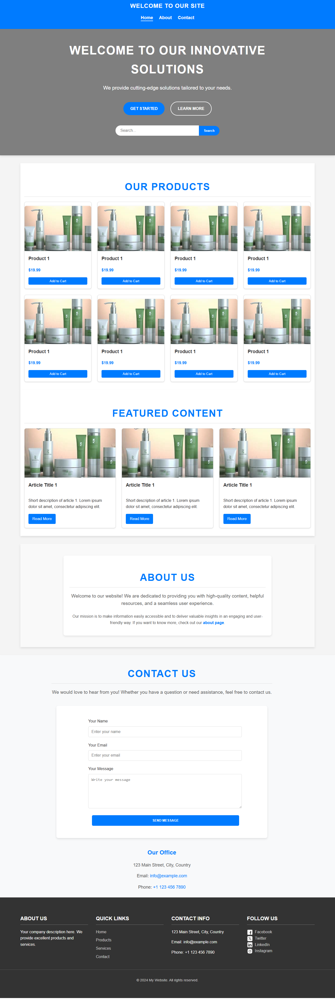

# My Website Project



This is a responsive and accessible website featuring a homepage with a hero section, product listings, an about us page, a contact form, and more.

## Features
- Responsive design with a focus on accessibility
- Hero section with dynamic buttons and search functionality
- Product listing grid
- Contact form with validation
- Smooth scrolling navigation

## Technologies Used
- HTML5
- CSS3
- JavaScript

## How to Use
1. Clone or download the repository:
   ```bash
   [git clone https://github.com/fahad-waseem247/your-repository-name.git](https://github.com/fahad-waseem247/accessible-webpage.git)
live URL: [https://fahad-waseem247.github.io/accessible-webpage/](https://fahad-waseem247.github.io/accessible-webpage/)
